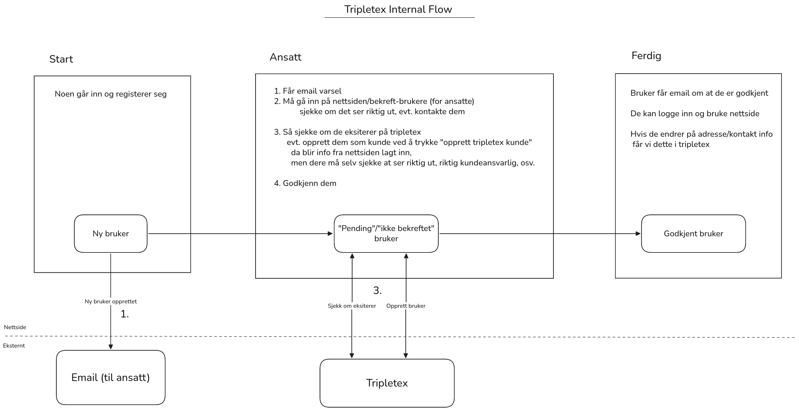

# Lavendel Hygiene Internal
Lavendel Hygiene Internal is two WordPress extensions for a custom webstore.

The extensions are as follows:
- Lavendel Hygiene Core: 
  - Custom registration
  - Manual customer approval
  - Status Emails
  - Gating, i.e. prevent non-approved users from viewing product prices
- LavendelHygiene Tripletex
  - Connects webstore with Tripletex API (accounting software)
  - Provide settings for setting URLs and tokens
  - Sync customers with tripletex counterpart
  - Sync product prices
  - Automatic order generation in tripletex on webstore checkout

## Project structure

```
custom-extension/
├─ core/
│  └─ lavendelhygiene-core.php            
└─ tripletex-api/
   ├─ lavendelhygiene-tripletex.php       
   └─ includes/
      ├─ api.php
      ├─ services.php
      ├─ settings-page.php
      └─ webhooks.php
```

## Requirements

- WordPress 6.x, WooCommerce active
- PHP 7.4+ 
- Tripletex consumer + employee tokens, and optional company id (0 = employee token’s company)

## Installation

1) Copy both plugin folders into wp-content/plugins:
- custom-extension/core --> wp-content/plugins/lavendelhygiene-core
- custom-extension/tripletex-api --> wp-content/plugins/lavendelhygiene-tripletex

2) Activate in WP Admin / Plugins:
- Lavendel Hygiene Core
- LavendelHygiene Tripletex

3) Configure Tripletex (WP Admin --> WooCommerce --> Tripletex):
- Base URL: https://tripletex.no/v2
- Consumer token, Employee token
- Company ID (0 for default), Webhook secret
- Click Test connection to verify and cache a session token.

## Usage

**User approval flow:** 
- Users register via Woo; they become pending
- Admins Manage users
  - Tripletex linking:
    - Manually enter “Tripletex ID” in field, or
    - If user does not exist you can click “Create in Tripletex”
  - Then click approve/deny
- User notified if approved/denied




**Checkout:**
- Approved customer places an order
- A Tripletex order is created:
  - With correct product selected
  - With correct customer selected
  - TODO: anything more?
- Tripletex ID stored on the Woo order

**Products:**
- Set _tripletex_product_id on Woo products to enable price sync.

## Webhooks

Endpoint: https://your-site.tld/wp-json/lh-ttx/v1/webhooks/event  
Auth: Authorization: Bearer <webhook_secret> (or X-Tripletex-Token / ?token=)

Handles:
- product.update: update price of product

Quick test:

```bash
curl -X POST \
  -H "Content-Type: application/json" \
  -H "Authorization: Bearer YOUR_SECRET" \
  -d '{"subscriptionId":1,"event":"product.update","id":123,"value":{}}' \
  https://your-site.tld/wp-json/lh-ttx/v1/webhooks/event
```

## Troubleshooting

- Logs: 
  - WooCommerce / Status / Logs --> source “lavendelhygiene-tripletex”.
- Session/token issues: 
  - re-enter tokens on the Tripletex settings page and “Clear session token”, then “Test connection”.
- Orders not created: 
  - Ensure the customer is approved and has a Tripletex link.

## Subscribe to Tripletex event

This plugin currently handles:
- `product.update` events, where we then update the price in the store

To make Tripletex call the webhook endpoint, you need to create subscriptions for the event.

Notes:
- Tripletex API Authorization uses Basic base64("<companyId>:<sessionToken>").
- Create a session token with your Consumer + Employee tokens.
- The webhook callback authenticates using your configured Webhook secret via Authorization: Bearer <secret>.

1) Create a session token (gets "token" and "expirationDate")
```bash
curl -X POST "https://tripletex.no/v2/token/session/:create" \
  -H "Accept: application/json" \
  -H "Content-Type: application/json" \
  -d '{
        "consumerToken":  "YOUR_CONSUMER_TOKEN",
        "employeeToken":  "YOUR_EMPLOYEE_TOKEN",
        "expirationDate": "'$(date -u -d "+2 days" +%F)'" 
      }'
```
Copy the value.token from the response.

2) Create subscriptions for the events by sending POST requests to `event/subscription`.
```bash
export BASE="https://tripletex.no/v2"
export COMPANY_ID=0
export SESSION_TOKEN="PASTE_SESSION_TOKEN_HERE"
export AUTH_BASIC=$(printf "%s:%s" "$COMPANY_ID" "$SESSION_TOKEN" | base64 -w0)

export TARGET_URL="https://example.com/wp-json/lh-ttx/v1/webhooks/event"
export CALLBACK_AUTH_NAME="Authorization"
export CALLBACK_AUTH_VALUE="Bearer YOUR_SECRET"  # must match the plugin's Webhook secret

# product.update
curl -X POST "$BASE/event/subscription" \
    -H "Accept: application/json" \
    -H "Content-Type: application/json" \
    -H "Authorization: Basic $AUTH_BASIC" \
    -d '{
          "event": "product.update",
          "targetUrl": "'$TARGET_URL'",
          "fields": "priceExcludingVatCurrency",
          "authHeaderName": "'$CALLBACK_AUTH_NAME'",
          "authHeaderValue": "'$CALLBACK_AUTH_VALUE'"
        }'
```

### Additional webhook subscrption commands
Verify subscription status
```bash
curl -s -X GET "$BASE/event/subscription" \
  -H "Accept: application/json" \
  -H "Authorization: Basic $AUTH_BASIC"
```
